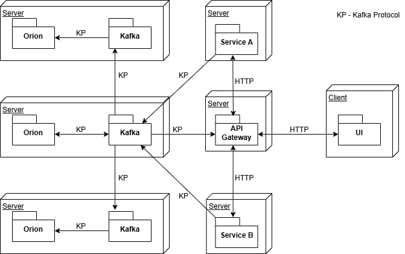

Vyhľadávacia služba Orion môže byť nasadená v jednoduchom režime alebo v režime replikácie v závislosti od vašich požiadaviek.

## Jednoduchý režim
V tomto prípade sa používa jeden server brokera a jedna služba Orion, ktoré môžu byť spustené na jednom serveri.

### Server
Nižšie je uvedený príklad konfigurácie celej serverovej časti prostredníctvom nástroja Docker Compose.
```yaml
version: '3.8'

services:
  broker:
    image: confluentinc/cp-kafka
    hostname: broker
    container_name: broker
    ports:
      - "9092:9092"
      - "9093:9093"
      - "9101:9101"
    environment:
      KAFKA_NODE_ID: 1
      KAFKA_LISTENER_SECURITY_PROTOCOL_MAP: 'CONTROLLER:PLAINTEXT,PLAINTEXT:PLAINTEXT,PLAINTEXT_HOST:PLAINTEXT'
      KAFKA_ADVERTISED_LISTENERS: 'PLAINTEXT://broker1:29092,PLAINTEXT_HOST://localhost:9092'
      KAFKA_OFFSETS_TOPIC_REPLICATION_FACTOR: 1
      KAFKA_GROUP_INITIAL_REBALANCE_DELAY_MS: 0
      KAFKA_TRANSACTION_STATE_LOG_MIN_ISR: 1
      KAFKA_TRANSACTION_STATE_LOG_REPLICATION_FACTOR: 1
      KAFKA_JMX_PORT: 9101
      KAFKA_JMX_HOSTNAME: localhost
      KAFKA_PROCESS_ROLES: 'broker,controller'
      KAFKA_CONTROLLER_QUORUM_VOTERS: '1@broker:29093'
      KAFKA_LISTENERS: 'PLAINTEXT://broker1:29092,CONTROLLER://broker1:29093,PLAINTEXT_HOST://0.0.0.0:9092'
      KAFKA_INTER_BROKER_LISTENER_NAME: 'PLAINTEXT'
      KAFKA_CONTROLLER_LISTENER_NAMES: 'CONTROLLER'
      KAFKA_LOG_DIRS: '/tmp/kraft-combined-logs'
      # Replace CLUSTER_ID with a unique base64 UUID using "bin/kafka-storage.sh random-uuid"
      CLUSTER_ID: 'MkU3OEVBNTcwNTJENDM2Qk'

  kafka-ui:
    image: provectuslabs/kafka-ui:latest
    ports:
      - "9999:8080"
    environment:
      DYNAMIC_CONFIG_ENABLED: true
      KAFKA_CLUSTERS_0_NAME: local
      KAFKA_CLUSTERS_0_BOOTSTRAPSERVERS: broker:29092


  orion-service:
    image: orion-service:0.0.18
    ports:
      - "8001:8001"
    environment:
      KAFKA_DELIVERY_TIMEOUT_MS: 5000
      KAFKA_REQUEST_TIMEOUT_MS: 5000
      KAFKA_MAX_BLOCK_MS: 5000
      SPRING_KAFKA_BOOTSTRAP_SERVERS: broker:29092
      ORION_SERVICE_CLUSTER_SIZE: 1
      ORION_SERVICE_NODE_ID: 1

networks:
  local-kafka:
    driver: bridge

volumes:
  db:
    driver: local

```
Po spustení tohto docker-compose súboru na lokálnom počítači
je možné pristupovať k prehľadu Kafka tém na adrese [http://localhost:9999](http://localhost:9999).


## Režime replikácie

